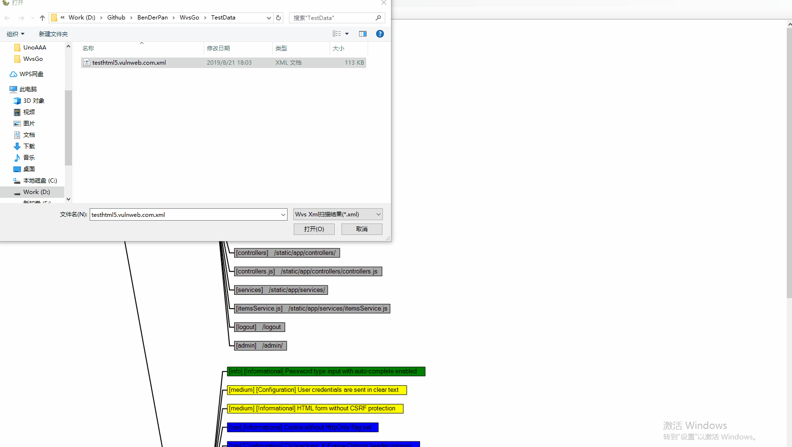

# WvsGo
A simple tool of Acunetix WVS(10.x). 


### 项目说明
当前项目包含三部分：
1. WvsGo.Parser： 基于.NetStandard版本的WVS结果解析库，支持解析WVS XML格式结果，当前已发布到Nuget [WvsGo.Parser](https://www.nuget.org/packages/WvsGo.Parser/)。

2. WvsGo.GraphViewer： 基于GoWin的WinForm图形化展示库，方便直接对扫描结果进行可视化查看，当前还比较粗糙，很丑！！！ PS: GoWin5.3注册已经完美逆向破解，考虑到版权问题，注册机源码暂时不打算传到Github,有需要的可以单独联系。


3. WvsGoDesktop: WinForm简单界面，拟集成wvs_console.exe的功能，实现批量扫描，自动生成xml结果，以及统一加载可视化分析，不过这个看精力了，不一定会持续更新，有兴趣的小伙伴可以Contribute一下。


### 快速开始
1. WvsGo.Parser

* 通过Nuget引用WvsGo.Parser包到你的当前项目；
* 通过 `WvsXmlParser.Parse`、`WvsXmlParser.TryParse`和`WvsXmlParser.LoadFromFile`对目标WVS扫描结果xml文件进行解析，后续直接进行业务逻辑处理即可。

```C#
var xmlObj = WvsXmlParser.LoadFromFile(XmlFilePath);
...
```
2. WvsGo.GraphViewer 加载显示WVS XML结果文件

```C#
graphViewer.LoadNodesFromXml(file) //直接加载数据并展示
```


